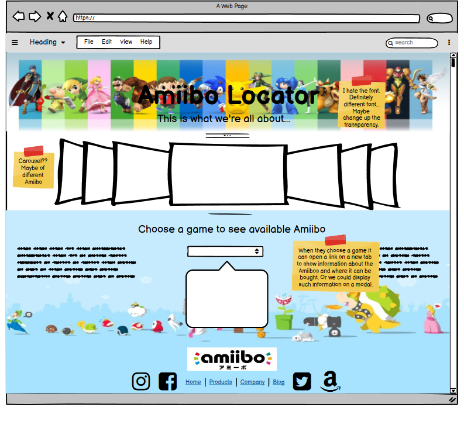

# AMIIBO LOCATOR
```
The function of this app is to provide the user with a fast method of 
shopping for amiibo's based on their favorite games. It would allow the 
user to search for amiibos and show availablity at BestBuy.

```
## ALGORITHM 
```
(rough)
1. Set up a basic HTML and CSS page to begin the project
2. Set up basic JS to begin the project
3. Connect APIs 
4. Build Carousel funcionality
5. Build search bar funcionality w/ API
```



